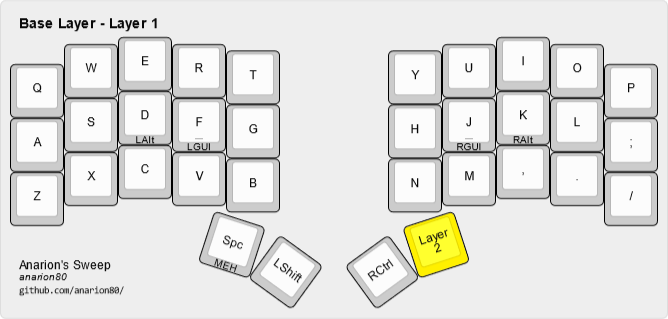
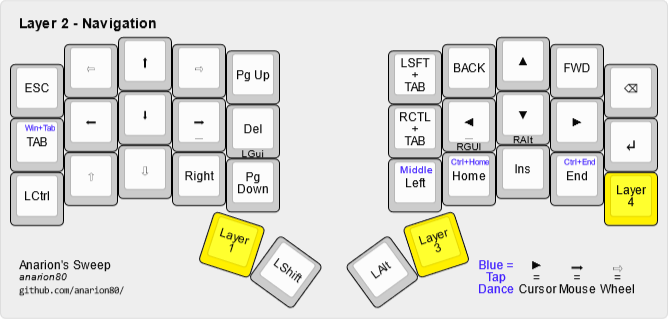
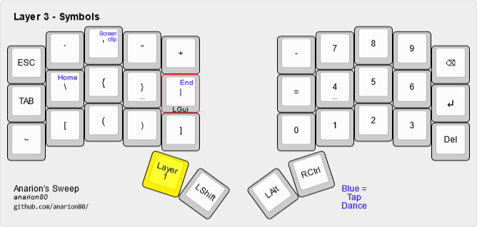
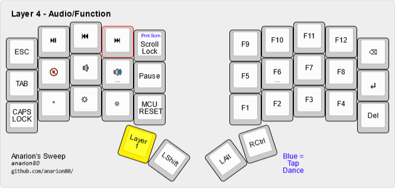

# sweep_qmk
34 Key Layout Using QMK For My Ferris Sweep

A usable 34-key keymap for the Ferris keyboard
===============================================

This is a 34-key layout I created and use on my Ferris Sweek keyboard. It is heavilly based on the work of .
Currently the keyboard has 4 layers:
* Layer 1 (Base layer, letters)
* Layer 2 (Navigation)
* Layer 3 (Symbols)
* Layer 4 (Audio/Function)

What do all these layers do?
----------------------------

### Layer 1: Base layer

Querty layer with all the keys and some basic symbols. Dedicated Space, Left Shift, Right Control, Mod-Tap modifiers on home row.
Enter, Backspace and Tab are available on all other layers.

### Layer 2: Navigation

Layer 2 is a Navigation layer - cursor keys, mouse movement and scrolling, other navigation keys are here.
Going back to Layer 1 is always under left thumb key.

### Layer 3: Symbols

Numbers on the right, symbols on the left.

### Layer 4: Audio/Function

Function keys on the right, audio and brightness control on the left.

How do I edit and update the keymap?
------------------------------------

To update:
* edit `config.h`, `keymap.c` and `rules.mk` to your liking.
* put the files in some `folder` in QMK repo folder for Ferris kemapys (for example, `<your qmk repo>/keyboards/ferris/keymaps/folder/`)
* compile: `qmk compile -kb ferris/sweep -km folder`
* Flash and enjoy!
